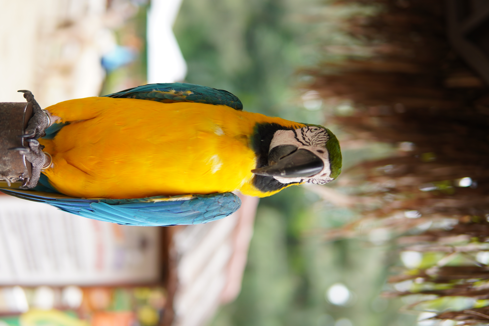
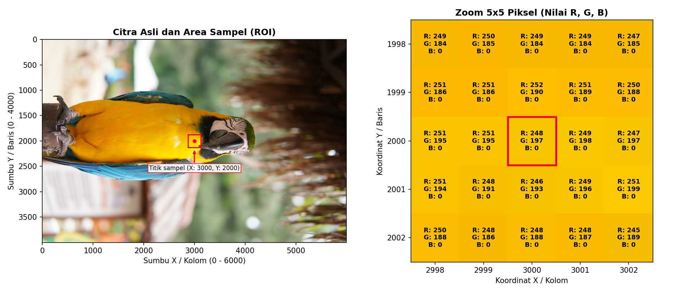
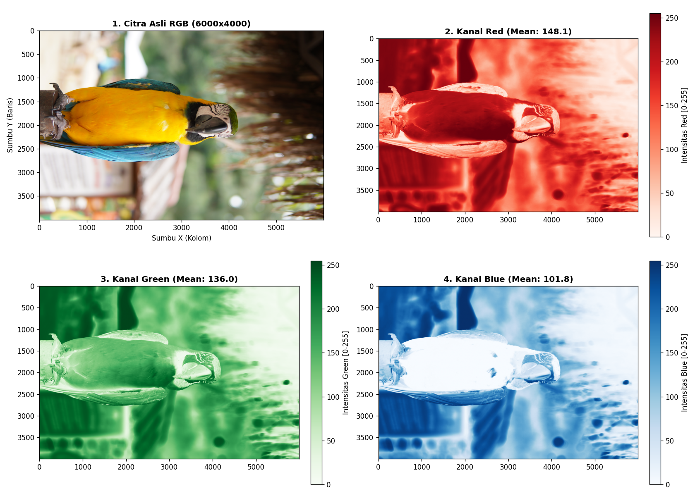
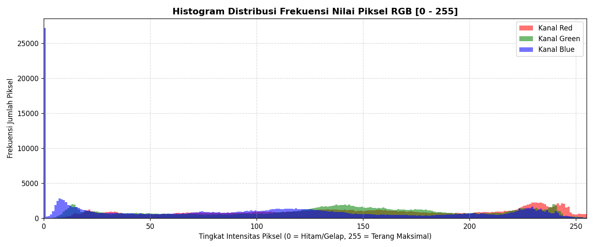

# Pengolahan Citra Digital: Analisis Matriks Piksel & Metadata EXIF
---

* **Nama** : Muhamad Faridzqi Suryadi
* **NIM**  : 24260045

---

## Source Image

  
   
  <em>Gambar 1: Citra Sumber (Format: MPO/JPEG, 6000 x 4000 piksel, Ukuran: 4.81 MB)</em>

---

## Visualisasi

### 1. Posisi Titik Sampel Citra & Zoom 5x5 Piksel
Pada tahap ini, citra utuh ditandai area sampelnya pada koordinat titik tengah $(X=3000, Y=2000)$. Area tersebut kemudian diperbesar (*zoom*) sebesar $5 \times 5$ piksel untuk menampilkan nilai matriks warna asli `[R, G, B]` pada masing-masing piksel:

  
   
  <em>Gambar 2: Lokasi sampel ROI (kiri) dan zoom nilai RGB 5x5 piksel (kanan).</em>

---

### 2. Dekomposisi Kanal Warna (RGB) & Histogram
Pemisahan citra ke dalam 3 saluran warna independen (Merah, Hijau, Biru) serta grafik distribusi frekuensi intensitas warnanya (rentang $0 - 255$):

  
   
  <em>Gambar 3: Dekomposisi intensitas kanal warna Red, Green, dan Blue.</em>

  
   
  <em>Gambar 4: Grafik histogram distribusi frekuensi intensitas nilai piksel RGB.</em>

---

## Library

* **[NumPy](https://numpy.org/)** 
* **[Pillow (PIL)](https://python-pillow.org/)** 
* **[Matplotlib](https://matplotlib.org/)**
